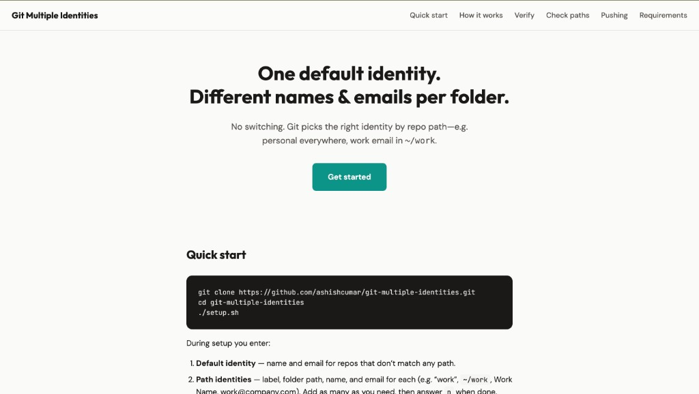

# Git Multiple Identities

**Use one default Git identity and different names/emails per folder.** No switching—Git picks the right identity by repo path (e.g. personal everywhere, work email in `~/work`).

[](https://ashishcumar.github.io/git-multiple-identities)

**→ [Open the website](https://ashishcumar.github.io/git-multiple-identities)** (docs, quick start, and more) · **Deploy:** [DEPLOY.md](DEPLOY.md)

---

## Contents

- [Quick start](#quick-start)
- [How it works](#how-it-works)
- [Verify](#verify)
- [Check your paths](#check-your-paths)
- [Pushing to GitHub](#pushing-to-github)
- [Requirements](#requirements)
- [Deploy the website](#deploy-the-website)

---

## Quick start

```bash
git clone https://github.com/ashishcumar/git-multiple-identities.git
cd git-multiple-identities
./setup.sh
```

During setup you enter:

1. **Default identity** — name and email for repos that don’t match any path.
2. **Path identities** — label, folder path, name, and email for each (e.g. “work”, `~/work`, Work Name, work@company.com). Add as many as you need, then answer `n` when done.

Your current `~/.gitconfig` is backed up automatically before any changes.

---

## How it works

- Your **default** name and email live in `~/.gitconfig`.
- Each path identity gets a small config file (e.g. `~/.gitconfig-work`) and a conditional include in `~/.gitconfig`: “for repos under this path, use this identity.”
- Any repo **outside** those paths uses the default identity.

Use **non-overlapping paths** (or put more specific paths first). The script adds the needed trailing slash for you.

---

## Verify

In any repo, run:

```bash
git config user.name && git config user.email
```

You should see the identity for that path (or the default if the repo isn’t under a configured path).

---

## Check your paths

**List all configured path identities** (paths from your `~/.gitconfig`):

```bash
grep -A1 'includeIf "gitdir:' ~/.gitconfig | grep path | sed 's/.*= //'
```

Or show path **and** config file so you can see which label goes where:

```bash
grep -B1 'path = .*\.gitconfig-' ~/.gitconfig
```

**See which identity applies in the current directory** (run from inside a repo):

```bash
echo "Path: $(pwd)" && git config user.name && git config user.email
```

**Quick one-liner** to list each configured path with its config file:

```bash
awk '/includeIf.*gitdir:/{getline; print $3}' ~/.gitconfig
```

---

## Pushing to GitHub

**Commit author** (name/email) comes from this setup. **Who can push** is decided by how you sign in:

| Method | Notes |
|--------|--------|
| **HTTPS** | One login per host. For different identities on the same host, use different remotes or SSH. |
| **SSH** | Use one key per identity. In `~/.ssh/config` add a `Host` (e.g. `github.com-work`) with `IdentityFile` for that key, then use that host in the remote URL. |

If push fails, check: `git remote -v`, and that you’re logged in (HTTPS) or using the right SSH key.

### “Your push would publish a private email address” (GH007)

GitHub blocks pushes when the commit email is **private** on your account. Fix it:

**Option 1 — Use GitHub’s noreply email (recommended)**

```bash
git config user.email "USERNAME@users.noreply.github.com"
git commit --amend --reset-author --no-edit
git push --set-upstream origin main
```

Use your exact noreply address from [GitHub → Settings → Emails](https://github.com/settings/emails).

**Option 2** — In [GitHub → Settings → Emails](https://github.com/settings/emails), make the email public or turn off “Block command line pushes that expose my email”.

---

## Requirements

- **Git 2.13+** (for `includeIf`)
- **Bash** (macOS or Linux)

---

## Deploy the website

The repo includes a ready-to-use site (`index.html` + `styles.css`). For maximum reachability:

1. **GitHub Pages** — In repo **Settings** → **Pages**, set **Source** to **Deploy from a branch**, branch `main`, folder **/ (root)**. Your site will be at `https://ashishcumar.github.io/git-multiple-identities/`.
2. **(Optional) js.org subdomain** — Get a short URL like `git-multiple-identities.js.org` by following [DEPLOY.md](DEPLOY.md).

Full steps and a reachability checklist are in [DEPLOY.md](DEPLOY.md).

---

## License

MIT
